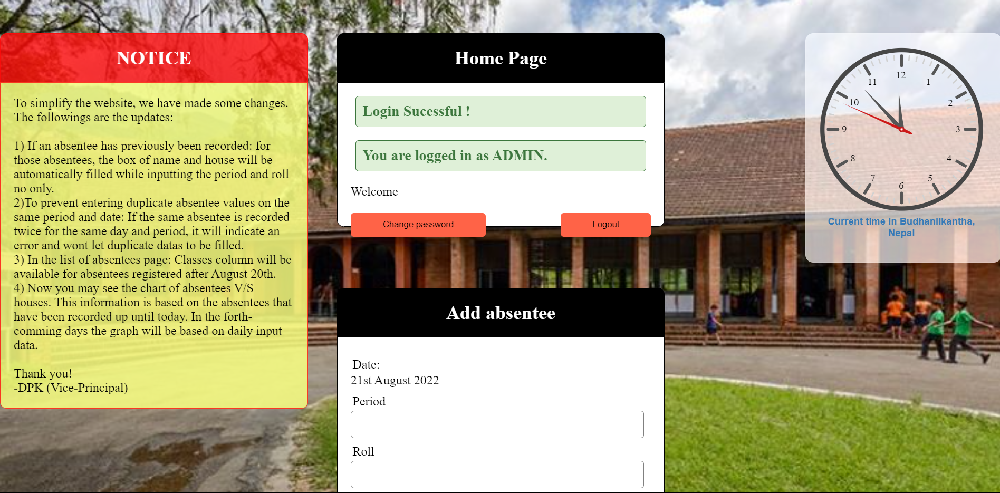
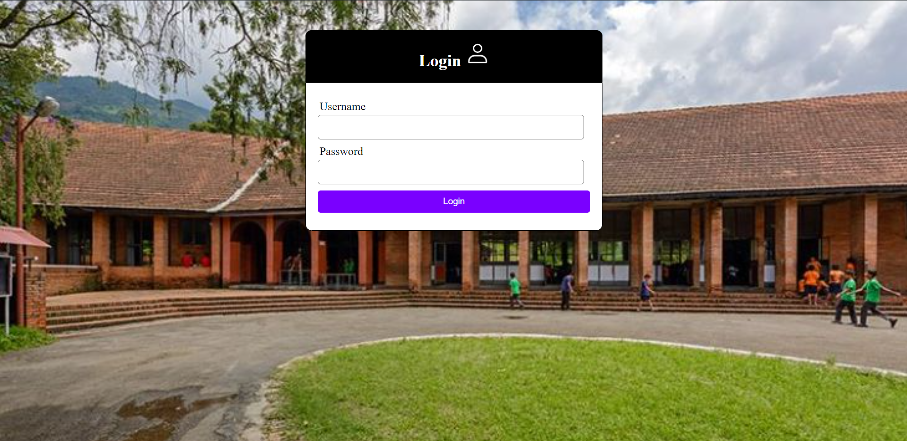
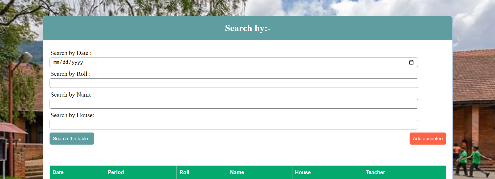

# Attendance Management System

This project is an **Attendance Management System** designed for recording the attendance of students. The system is primarily used by the admin and teachers to efficiently manage student attendance records.

## Features

- **Admin Control**: The admin has full control over the platform. They can:
  - Create new teacher accounts.
  - Reset passwords for teachers.
  - Manage user roles and permissions.

- **Teacher Functions**: Teachers can:
  - Log in to the platform using their credentials.
  - Fill out absentee forms for students, specifying the class and roll number.
  - View previously submitted records.

- **User Registration**: New user accounts can be created using the `register.php` file. This file should be kept on the server only when new users need to be registered.

- **Public Display**: Attendance records are accessible to everyone, including parents and guardians, via the `../display/` folder. This ensures transparency and easy access to absentee information.

- **Auto-Fill Feature**: The system becomes smarter over time. As the database grows, the auto-fill function helps teachers by automatically filling in details such as the student's name based on the roll number entered.

## Usage During Pandemic

This system was developed and utilized during the pandemic at **Budhanilkantha School, Nepal**. It proved to be extremely helpful in managing attendance during challenging times, making the process more streamlined and accessible.

## Database Structure

- **Attendance Database**: Stores records of student absentees.
- **User Database**: Stores information related to user accounts, including teacher credentials.

## Preview

  
  
  
*(Replace the above link with actual screenshots of the website.)*

## Getting Started

### Prerequisites

Ensure you have the following:
- A web server (e.g., Apache)
- PHP installed on the server
- MySQL or any other supported database system

### Installation

1. Clone the repository:
   ```bash
   git clone https://github.com/sphinx78/Class-absent-record.git
   ```
2. Set up the databases as per the provided php scripts.
3. Place the `register.php` file on the server only when new users need to be registered.
4. Ensure the `../display/` directory is accessible to the public for displaying absentee records.

### Usage

1. Admin can create teacher accounts and manage user roles.
2. Teachers can log in to the system and fill out absentee forms.
3. Absentee records can be viewed by anyone from the `../display/` directory.

## License

This project is licensed
